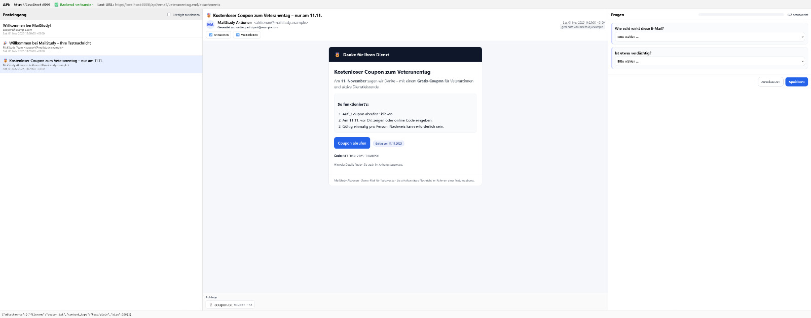
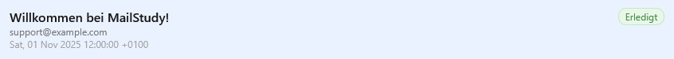
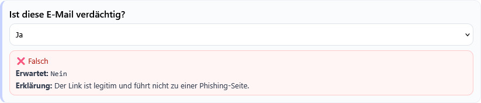

# MailStudy — Phishing-/Trainings-Postfach

Ein leichtgewichtiges System, um **realistische E-Mails (.eml)** in einer **Postfach-UI** anzuzeigen, dazu **Fragen** je E-Mail zu stellen und Antworten **pro Teilnehmer** zu speichern. Unterstützt zwei Modi:

* **Test:** Teilnehmer bewerten, Antworten werden gespeichert, **erneute Bewertung pro E-Mail/PID gesperrt**.
* **Training:** Nach Abgabe zeigt die rechte Seite **Korrekt/Fehl-Feedback** inkl. **Erklärung**.
* **Admin:** Lösungen je E-Mail pflegen (inkl. Erklärung), Teilnehmer/Antworten exportieren.

Front- und Backend laufen in Docker. E-Mails und Daten liegen als Dateien/NDJSON auf dem Host.


## Inhaltsverzeichnis

1. [Features](#features)
2. [Schnellstart (Docker)](#schnellstart-docker)
3. [Verzeichnisstruktur](#verzeichnisstruktur)
4. [Backend](#backend)

   * [Umgebungsvariablen](#umgebungsvariablen-backend)
   * [API-Endpunkte](#api-endpunkte)
5. [Frontend](#frontend)

   * [Routen & URL-Schema](#routen--url-schema)
   * [Build & Konfiguration](#build--konfiguration)
6. [Datenformate](#datenformate)

   * [`questions.json`](#questionsjson)
   * [`supposed_answers.json`](#supposed_answersjson)
   * [`answers.jsonl` (Ergebnisse)](#answersjsonl-ergebnisse)
7. [E-Mails (.eml) bereitstellen](#e-mails-eml-bereitstellen)
8. [Inline-Bilder & Anhänge](#inline-bilder--anhänge)
9. [Sicherheitshinweise](#sicherheitshinweise)
10. [Troubleshooting](#troubleshooting)

---

## Features

* Realistische Anzeige von `.eml` inkl. **Absender/Empfänger/Datum/Betreff**, **HTML-Body**, **Anhänge**, **inline CIDs**.
* **Dynamische Fragen** pro E-Mail (Skala, Auswahl, Freitext). **Unterfragen** via `show_if`.
* **Testmodus:** Antworten werden gespeichert, pro E-Mail+Teilnehmer gesperrt (**Erledigt**-Badge).
* **Trainingsmodus:** Sofortiges **Richtig/Falsch**-Feedback je Frage + **Erklärung** aus Admin-Lösungen.
* **Admin-Panel** (passwortgeschützt, Token-basiert):

  * Antworten als „erwartete Lösungen“ je E-Mail speichern (inkl. Erklärung).
  * Teilnehmer auflisten, Export als **NDJSON Stream**.
* **Mehrere Teilnehmer** via URL-Pfad: Ergebnisse getrennt nach `participant_id`.
* **Dateibasierte Ablage** – keine DB nötig; Backups simpel.

Hier gibt es paar Eindrücke der Oberfläche:

**Dies ist die Testseite**



**Sobald eine E-Mail bearbeitet wurde, wird dies links angezeigt**



**Im Trainingsmodus gibt es auch die Möglichkeit die Antwort direkt nach Abgabe der Antwort einzublenden**



---

## Schnellstart (Docker)

Voraussetzungen: Docker & Docker Compose.

```bash
# 1) Projekt klonen/ablegen
# Struktur: ./backend, ./frontend, ./emails (siehe unten)

# 2) Environment setzen (optional, siehe Variablen)
export ADMIN_PASSWORD='ChangeMe'

# 3) Starten
docker compose up --build

# Backend erreichbar:
#   http://localhost:8000/api/status
# Frontend erreichbar:
#   http://localhost:3000
```

Standard-Anmeldedaten für Admin sind über `ADMIN_PASSWORD` steuerbar (niemals mit Default betreiben).

---

## Verzeichnisstruktur

```
.
├── backend/
│   └── app.py                 # FastAPI Server
├── frontend/
│   ├── index.html
│   └── src/
│       └── App.jsx            # gesamte App-Logik (UI)
├── emails/                    # Arbeitsverzeichnis (Volume)
│   ├── *.eml                  # deine Test-/Trainingsmails
│   ├── questions.json         # Fragenkatalog pro E-Mail
│   ├── supposed_answers.json  # erwartete Antworten (Admin)
│   └── answers.jsonl          # Ergebnisse (NDJSON, append-only)
└── docker-compose.yml
```

> Das Verzeichnis `emails/` wird in den Backend-Container gemountet. So bleiben E-Mails & Daten persistent.

---

## Backend

Das Backend ist eine **FastAPI**-App (`backend/app.py`), gestartet über Uvicorn.

### Umgebungsvariablen (Backend)

| Variable          | Default    | Beschreibung                                                              |
| ----------------- | ---------- | ------------------------------------------------------------------------- |
| `EMAIL_DIR`       | `/emails`  | Pfad im Container, wohin `.eml` & JSONs gemountet werden                  |
| `ADMIN_PASSWORD`  | `ChangeMe` | **Unbedingt setzen!** Wird für HMAC-Signaturen der Admin-Tokens verwendet |
| `ADMIN_TOKEN_TTL` | `43200`    | Gültigkeit Admin-Token in Sekunden (Default: 12h)                         |

**Docker Compose Beispiel**:

```yaml
services:
  backend:
    image: python:3.11
    working_dir: /app
    volumes:
      - ./backend:/app
      - ./emails:/emails
    command: bash -c "pip install fastapi uvicorn python-multipart && uvicorn app:app --host 0.0.0.0 --port 8000"
    ports:
      - "8000:8000"
    environment:
      - EMAIL_DIR=/emails
      - ADMIN_PASSWORD=${ADMIN_PASSWORD}
      - ADMIN_TOKEN_TTL=43200
```

### API-Endpunkte

**Status & Inhalte**

* `GET /api/status` → `{ ok, time, email_dir, emails_found }`
* `GET /api/emails` → Liste `{id, subject, from, date}` aller `.eml`
* `GET /api/email/{eid}` → vollständige E-Mail (Header, HTML/Text, Attach-Metadaten)
* `GET /api/email/{eid}/attachments` → Metadaten der Anhänge
* `GET /api/email/{eid}/attachment/{index}` → Download Attachment
* `GET /api/email/{eid}/inline/{cid}` → Auslieferung inline-CID (Bilder etc.)

**Fragen & Antworten**

* `GET /api/questions/{eid}` → Fragenarray für E-Mail
* `GET /api/answered?participant=P001` → `{ answered: ["mail1.eml", ...] }`
* `POST /api/answer` → speichert Antwortsatz (`answers.jsonl`, siehe Format)

Request-Body:

```json
{
  "email_id": "foo.eml",
  "participant_id": "P001",
  "answers": { "q1": "Ja", "q2": "5" },
  "mode": "test" | "training" | "admin"
}
```

* Im **Test**modus blockiert der Server doppelte Bewertungen für dieselbe E-Mail/PID mit **409**.

**Admin (Token-Pflicht)**

* `POST /api/admin/login` → `{ token, ttl_seconds }`
  Body: `{ "password": "<ADMIN_PASSWORD>" }`
* `GET /api/supposed/{eid}` → erwartete Lösungen für E-Mail (inkl. Merge mit `default`)
* `POST /api/supposed/{eid}` *(Authorization: Bearer <token>)*
  Body: `{ "solutions": { "q1": { "solution": "Ja", "explanation": "..." }, "q2": 5 } }`
* `GET /api/participants` *(Bearer)* → `{ participants: ["P001", "P002"] }`
* `GET /api/export/answers?participant=P001` *(Bearer)* → NDJSON Stream

---

## Frontend

Vite/React Single-Page App. Zeigt 3 Spalten:

* **Links**: Posteingang (E-Mail-Liste). „Erledigt“ Badge, Hide-Done Filter.
* **Mitte**: Header (Von/An/Betreff/Datum/Domain), HTML-Body (via `iframe srcDoc`), Anhänge.
* **Rechts**: Fragenformular; je nach Modus gesperrt/Feedback/Admin-Werkzeuge.

### Routen & URL-Schema

* **`/test/:pid`** – Testmodus für Teilnehmer `pid`
* **`/training/:pid`** – Trainingsmodus für Teilnehmer `pid`
* **`/admin`** – Admin-Panel (**Login im Start-Overlay nötig**)
* **`/test`** oder **`/training`** **ohne** `:pid` → **blockiert** (kein Laden, Hinweis + Overlay)

> Beim ersten Aufruf erscheint ein **Start-Overlay** (Moduswahl).
> Für **Admin** muss das Passwort **direkt im Overlay** eingegeben werden (Backend-Login); sonst kein Zugang.

### Build & Konfiguration

Standardmäßig erwartet das Frontend, dass das Backend auf Port **8000** läuft.

* Über **ENV** kann eine API-Basis gesetzt werden:
  `VITE_API_BASE=https://example.org:8000`
* Ohne ENV:

  * In Docker (Service-Netz) verwendet die UI automatisch `http://backend:8000`.
  * Lokal nutzt sie `http(s)://<Host>:8000`.

**Produktionsbuild (im Container)**:

```bash
docker compose up --build
# Frontend: Vite build, dann npx serve -s dist auf Port 3000
```

---

## Datenformate

### `questions.json`

Datei im `emails/`-Ordner. Fragen können global (`"default"`) oder **pro E-Mail-Datei** (`"file.eml"`) definiert werden.

```json
{
  "default": [
    { "id": "is_phish", "text": "Ist diese E-Mail verdächtig?", "type": "choice", "options": ["Ja", "Nein"] },
    { "id": "confidence", "text": "Wie sicher bist du?", "type": "scale" }
  ],
  "invoice.eml": [
    { "id": "link_safe", "text": "Wirkt der Link seriös?", "type": "choice", "options": ["Ja", "Nein"] },
    {
      "id": "reason",
      "text": "Begründung",
      "type": "text",
      "show_if": { "link_safe": ["Nein"] }      // Unterfrage nur wenn link_safe = Nein
    }
  ]
}
```

**Feldbeschreibung:**

* `id` (string, Pflicht): eindeutiger Schlüssel je Frage
* `text` (string): Frage
* `type` (string): `choice` | `scale` | `text`
* `options` (array): für `choice`
* `show_if` (object): bedingte Anzeige, z. B. `{ "<andereFrageId>": ["Wert1","Wert2"] }`
* `subquestions` (array): optionale Unterfragen (gleiches Schema, rekursiv)

### `supposed_answers.json`

Erwartete Antworten (für **Training**-Feedback & **Admin**-Anzeige). Kann `default` und pro E-Mail enthalten.
Jeder Eintrag pro Frage kann **einfacher Wert** *oder* Objekt sein:

```json
{
  "default": {},
  "invoice.eml": {
    "link_safe": { "solution": "Nein", "explanation": "Domain weicht ab (paypaI.com statt paypal.com)" },
    "confidence": { "solution": ["4", "5"], "explanation": "Hohe Sicherheit erwartet" },
    "reason": { "solution_regex": "(domain|absender|link)", "solution_flags": "i", "explanation": "Einer dieser Punkte sollte genannt werden" }
  }
}
```

Erlaubt:

* `solution`: exakter Wert **oder Array** erlaubter Werte
* `solution_regex` + `solution_flags` (optional): RegEx-Match gegen Nutzerantwort (String)
* `explanation`: kurzer Text, der im **Training** angezeigt wird

### `answers.jsonl` (Ergebnisse)

Append-only NDJSON (eine JSON-Zeile pro Abgabe):

```json
{"email_id":"invoice.eml","participant_id":"P001","mode":"test","answers":{"link_safe":"Nein","confidence":"4"},"timestamp":"2025-11-01T12:34:56Z"}
```

---

## E-Mails (.eml) bereitstellen

* Lege `.eml` Dateien in **`./emails/`** ab (werden in den Container nach `/emails` gemountet).
* Nach dem Ablegen: Seite neu laden → `GET /api/emails` listet neue E-Mails.

**Test-Mail schnell erstellen (Linux/Mac):**

```bash
cat > emails/demo.eml <<'EML'
From: "Support" <support@example.com>
To: Alice <alice@example.org>
Subject: Ihr Konto wurde eingeschränkt
Date: Sat, 01 Nov 2025 12:00:00 +0100
MIME-Version: 1.0
Content-Type: text/html; charset=UTF-8

<html><body>
  <p>Hallo Alice,</p>
  <p>Bitte bestätigen Sie Ihr Konto:<br>
  <a href="http://paypaI.com-security.example">Jetzt bestätigen</a></p>
</body></html>
EML
```

---

## Inline-Bilder & Anhänge

* **Inline (CID):** Das Backend ersetzt in HTML `src="cid:..."`
  automatisch durch `src="/api/email/{eid}/inline/{cid}"`.
* **Anhänge:** werden als Liste unter dem Body angezeigt, Download via
  `/api/email/{eid}/attachment/{index}`.

---

## Sicherheitshinweise

* **Admin-Password setzen:** `ADMIN_PASSWORD` **muss** gesetzt werden (stark, geheim).
  Tokens sind HMAC-signiert mit dem Passwort.
* **Admin-Zugriff nur via HTTPS** (Reverse Proxy/Ingress) in produktiven Umgebungen.
* **Dateizugriff:** Backend schreibt/liest nur im gemounteten `EMAIL_DIR`.
  Schreibzugriffe (`answers.jsonl`, `supposed_answers.json`) erfolgen **atomar**.
* **CORS:** aktuell permissiv (`*`) für einfache Tests. Für Produktion einschränken.
* **Kein direkter API-Zugriff** über die UI ohne PID: Das Frontend lädt auf `/test`/`/training` **ohne** PID nichts.
  Optional lässt sich im Backend zusätzlich ein Guard ergänzen (z. B. `GET /api/emails` nur mit `?participant=...` zulassen).

---

## Troubleshooting

**Backend startet nicht / SyntaxError in `app.py`:**

* Stelle sicher, dass **kein JavaScript** in der Python-Datei gelandet ist.
  Check: `docker compose exec backend python -m py_compile /app/app.py`.

**`/test` oder `/training` ohne PID zeigt Inhalt:**

* In der gelieferten `App.jsx` ist ein **Route-Guard**:
  Ohne PID wird auf `/` umgeleitet und **nichts** geladen. Bitte sicherstellen, dass das Frontend neu gebaut wurde.

**Frontend 3000 lädt, aber keine E-Mails:**

* Prüfe Backend: `curl -s http://localhost:8000/api/status` → `{ "ok": true }`
* Prüfe Netz im Compose: `docker compose exec frontend curl -s http://backend:8000/api/emails`
* Setze `VITE_API_BASE` falls Frontend/Backend nicht im selben Host/Netz liegen.

**Vite Buildfehler (`@vitejs/plugin-react` / `index.html` / `index.css`):**

* `npm install` im Frontend ausführen (oder `docker compose up --build`).
* Stelle sicher, dass `index.html` und `src/main.jsx`/`src/App.jsx` vorhanden sind und `./src/index.css` korrekt verlinkt ist.

**Inline-Bilder fehlen:**

* Hat die E-Mail `Content-ID`-Header und `src="cid:...“` im HTML? Das Backend mappt CIDs → `/api/email/{eid}/inline/{cid}`.

**Erneute Bewertung im Testmodus möglich:**

* Der Server blockiert doppelte Abgaben `email_id + participant_id` im Modus **test** mit **409**.
  Prüfe, ob du den **Modus korrekt** setzt (`mode: "test"`).

---

## Nützliche cURL-Checks

```bash
# Status
curl -s http://localhost:8000/api/status | jq

# E-Mail-Liste
curl -s http://localhost:8000/api/emails | jq

# Fragen für eine Mail
curl -s http://localhost:8000/api/questions/demo.eml | jq

# Antwort speichern (Training)
curl -s -X POST http://localhost:8000/api/answer \
  -H "Content-Type: application/json" \
  -d '{"email_id":"demo.eml","participant_id":"P001","mode":"training","answers":{"is_phish":"Ja"}}' | jq

# Admin Login (Token holen)
TOKEN=$(curl -s -X POST http://localhost:8000/api/admin/login \
  -H "Content-Type: application/json" -d '{"password":"DeinSicheresPasswort!"}' | jq -r .token)

# Lösungen setzen
curl -s -X POST http://localhost:8000/api/supposed/demo.eml \
  -H "Authorization: Bearer $TOKEN" -H "Content-Type: application/json" \
  -d '{"solutions":{"is_phish":{"solution":"Ja","explanation":"Absenderdomain weicht ab"}}}' | jq

# Export Antworten (alle)
curl -s -H "Authorization: Bearer $TOKEN" http://localhost:8000/api/export/answers | head
```

---

Viel Erfolg! Wenn du willst, erweitere ich gern das Backend noch um einen **Server-Guard**, der `/api/emails` nur mit `?participant` in Test/Training freigibt — dann ist auch die API ohne PID strikter geschützt.


=======
---

# MailStudy — Phishing-/Trainings-Postfach

Ein leichtgewichtiges System, um **realistische E-Mails (.eml)** in einer **Postfach-UI** anzuzeigen, dazu **Fragen** je E-Mail zu stellen und Antworten **pro Teilnehmer** zu speichern. Unterstützt zwei Modi:

* **Test:** Teilnehmer bewerten, Antworten werden gespeichert, **erneute Bewertung pro E-Mail/PID gesperrt**.
* **Training:** Nach Abgabe zeigt die rechte Seite **Korrekt/Fehl-Feedback** inkl. **Erklärung**.
* **Admin:** Lösungen je E-Mail pflegen (inkl. Erklärung), Teilnehmer/Antworten exportieren.

Front- und Backend laufen in Docker. E-Mails und Daten liegen als Dateien/NDJSON auf dem Host.

---

## Inhaltsverzeichnis

1. [Features](#features)
2. [Schnellstart (Docker)](#schnellstart-docker)
3. [Verzeichnisstruktur](#verzeichnisstruktur)
4. [Backend](#backend)

   * [Umgebungsvariablen](#umgebungsvariablen-backend)
   * [API-Endpunkte](#api-endpunkte)
5. [Frontend](#frontend)

   * [Routen & URL-Schema](#routen--url-schema)
   * [Build & Konfiguration](#build--konfiguration)
6. [Datenformate](#datenformate)

   * [`questions.json`](#questionsjson)
   * [`supposed_answers.json`](#supposed_answersjson)
   * [`answers.jsonl` (Ergebnisse)](#answersjsonl-ergebnisse)
7. [E-Mails (.eml) bereitstellen](#e-mails-eml-bereitstellen)
8. [Inline-Bilder & Anhänge](#inline-bilder--anhänge)
9. [Sicherheitshinweise](#sicherheitshinweise)
10. [Troubleshooting](#troubleshooting)
11. [Entwicklung (ohne Docker)](#entwicklung-ohne-docker)

---

## Features

* Realistische Anzeige von `.eml` inkl. **Absender/Empfänger/Datum/Betreff**, **HTML-Body**, **Anhänge**, **inline CIDs**.
* **Dynamische Fragen** pro E-Mail (Skala, Auswahl, Freitext). **Unterfragen** via `show_if`.
* **Testmodus:** Antworten werden gespeichert, pro E-Mail+Teilnehmer gesperrt (**Erledigt**-Badge).
* **Trainingsmodus:** Sofortiges **Richtig/Falsch**-Feedback je Frage + **Erklärung** aus Admin-Lösungen.
* **Admin-Panel** (passwortgeschützt, Token-basiert):

  * Antworten als „erwartete Lösungen“ je E-Mail speichern (inkl. Erklärung).
  * Teilnehmer auflisten, Export als **NDJSON Stream**.
* **Mehrere Teilnehmer** via URL-Pfad: Ergebnisse getrennt nach `participant_id`.
* **Dateibasierte Ablage** – keine DB nötig; Backups simpel.

---

## Schnellstart (Docker)

Voraussetzungen: Docker & Docker Compose.

```bash
# 1) Projekt klonen/ablegen
# Struktur: ./backend, ./frontend, ./emails (siehe unten)

# 2) Environment setzen (optional, siehe Variablen)
export ADMIN_PASSWORD='ChangeMe'

# 3) Starten
docker compose up --build

# Backend erreichbar:
#   http://localhost:8000/api/status
# Frontend erreichbar:
#   http://localhost:3000
```

Standard-Anmeldedaten für Admin sind über `ADMIN_PASSWORD` steuerbar (niemals mit Default betreiben).

---

## Verzeichnisstruktur

```
.
├── backend/
│   └── app.py                 # FastAPI Server
├── frontend/
│   ├── index.html
│   └── src/
│       └── App.jsx            # gesamte App-Logik (UI)
├── emails/                    # Arbeitsverzeichnis (Volume)
│   ├── *.eml                  # deine Test-/Trainingsmails
│   ├── questions.json         # Fragenkatalog pro E-Mail
│   ├── supposed_answers.json  # erwartete Antworten (Admin)
│   └── answers.jsonl          # Ergebnisse (NDJSON, append-only)
└── docker-compose.yml
```

> Das Verzeichnis `emails/` wird in den Backend-Container gemountet. So bleiben E-Mails & Daten persistent.

---

## Backend

Das Backend ist eine **FastAPI**-App (`backend/app.py`), gestartet über Uvicorn.

### Umgebungsvariablen (Backend)

| Variable          | Default    | Beschreibung                                                              |
| ----------------- | ---------- | ------------------------------------------------------------------------- |
| `EMAIL_DIR`       | `/emails`  | Pfad im Container, wohin `.eml` & JSONs gemountet werden                  |
| `ADMIN_PASSWORD`  | `ChangeMe` | **Unbedingt setzen!** Wird für HMAC-Signaturen der Admin-Tokens verwendet |
| `ADMIN_TOKEN_TTL` | `43200`    | Gültigkeit Admin-Token in Sekunden (Default: 12h)                         |

**Docker Compose Beispiel**:

```yaml
services:
  backend:
    image: python:3.11
    working_dir: /app
    volumes:
      - ./backend:/app
      - ./emails:/emails
    command: bash -c "pip install fastapi uvicorn python-multipart && uvicorn app:app --host 0.0.0.0 --port 8000"
    ports:
      - "8000:8000"
    environment:
      - EMAIL_DIR=/emails
      - ADMIN_PASSWORD=${ADMIN_PASSWORD}
      - ADMIN_TOKEN_TTL=43200
```

### API-Endpunkte

**Status & Inhalte**

* `GET /api/status` → `{ ok, time, email_dir, emails_found }`
* `GET /api/emails` → Liste `{id, subject, from, date}` aller `.eml`
* `GET /api/email/{eid}` → vollständige E-Mail (Header, HTML/Text, Attach-Metadaten)
* `GET /api/email/{eid}/attachments` → Metadaten der Anhänge
* `GET /api/email/{eid}/attachment/{index}` → Download Attachment
* `GET /api/email/{eid}/inline/{cid}` → Auslieferung inline-CID (Bilder etc.)

**Fragen & Antworten**

* `GET /api/questions/{eid}` → Fragenarray für E-Mail
* `GET /api/answered?participant=P001` → `{ answered: ["mail1.eml", ...] }`
* `POST /api/answer` → speichert Antwortsatz (`answers.jsonl`, siehe Format)

Request-Body:

```json
{
  "email_id": "foo.eml",
  "participant_id": "P001",
  "answers": { "q1": "Ja", "q2": "5" },
  "mode": "test" | "training" | "admin"
}
```

* Im **Test**modus blockiert der Server doppelte Bewertungen für dieselbe E-Mail/PID mit **409**.

**Admin (Token-Pflicht)**

* `POST /api/admin/login` → `{ token, ttl_seconds }`
  Body: `{ "password": "<ADMIN_PASSWORD>" }`
* `GET /api/supposed/{eid}` → erwartete Lösungen für E-Mail (inkl. Merge mit `default`)
* `POST /api/supposed/{eid}` *(Authorization: Bearer <token>)*
  Body: `{ "solutions": { "q1": { "solution": "Ja", "explanation": "..." }, "q2": 5 } }`
* `GET /api/participants` *(Bearer)* → `{ participants: ["P001", "P002"] }`
* `GET /api/export/answers?participant=P001` *(Bearer)* → NDJSON Stream

---

## Frontend

Vite/React Single-Page App. Zeigt 3 Spalten:

* **Links**: Posteingang (E-Mail-Liste). „Erledigt“ Badge, Hide-Done Filter.
* **Mitte**: Header (Von/An/Betreff/Datum/Domain), HTML-Body (via `iframe srcDoc`), Anhänge.
* **Rechts**: Fragenformular; je nach Modus gesperrt/Feedback/Admin-Werkzeuge.

### Routen & URL-Schema

* **`/test/:pid`** – Testmodus für Teilnehmer `pid`
* **`/training/:pid`** – Trainingsmodus für Teilnehmer `pid`
* **`/admin`** – Admin-Panel (**Login im Start-Overlay nötig**)
* **`/test`** oder **`/training`** **ohne** `:pid` → **blockiert** (kein Laden, Hinweis + Overlay)

> Beim ersten Aufruf erscheint ein **Start-Overlay** (Moduswahl).
> Für **Admin** muss das Passwort **direkt im Overlay** eingegeben werden (Backend-Login); sonst kein Zugang.

### Build & Konfiguration

Standardmäßig erwartet das Frontend, dass das Backend auf Port **8000** läuft.

* Über **ENV** kann eine API-Basis gesetzt werden:
  `VITE_API_BASE=https://example.org:8000`
* Ohne ENV:

  * In Docker (Service-Netz) verwendet die UI automatisch `http://backend:8000`.
  * Lokal nutzt sie `http(s)://<Host>:8000`.

**Produktionsbuild (im Container)**:

```bash
docker compose up --build
# Frontend: Vite build, dann npx serve -s dist auf Port 3000
```

---

## Datenformate

### `questions.json`

Datei im `emails/`-Ordner. Fragen können global (`"default"`) oder **pro E-Mail-Datei** (`"file.eml"`) definiert werden.

```json
{
  "default": [
    { "id": "is_phish", "text": "Ist diese E-Mail verdächtig?", "type": "choice", "options": ["Ja", "Nein"] },
    { "id": "confidence", "text": "Wie sicher bist du?", "type": "scale" }
  ],
  "invoice.eml": [
    { "id": "link_safe", "text": "Wirkt der Link seriös?", "type": "choice", "options": ["Ja", "Nein"] },
    {
      "id": "reason",
      "text": "Begründung",
      "type": "text",
      "show_if": { "link_safe": ["Nein"] }      // Unterfrage nur wenn link_safe = Nein
    }
  ]
}
```

**Feldbeschreibung:**

* `id` (string, Pflicht): eindeutiger Schlüssel je Frage
* `text` (string): Frage
* `type` (string): `choice` | `scale` | `text`
* `options` (array): für `choice`
* `show_if` (object): bedingte Anzeige, z. B. `{ "<andereFrageId>": ["Wert1","Wert2"] }`
* `subquestions` (array): optionale Unterfragen (gleiches Schema, rekursiv)

### `supposed_answers.json`

Erwartete Antworten (für **Training**-Feedback & **Admin**-Anzeige). Kann `default` und pro E-Mail enthalten.
Jeder Eintrag pro Frage kann **einfacher Wert** *oder* Objekt sein:

```json
{
  "default": {},
  "invoice.eml": {
    "link_safe": { "solution": "Nein", "explanation": "Domain weicht ab (paypaI.com statt paypal.com)" },
    "confidence": { "solution": ["4", "5"], "explanation": "Hohe Sicherheit erwartet" },
    "reason": { "solution_regex": "(domain|absender|link)", "solution_flags": "i", "explanation": "Einer dieser Punkte sollte genannt werden" }
  }
}
```

Erlaubt:

* `solution`: exakter Wert **oder Array** erlaubter Werte
* `solution_regex` + `solution_flags` (optional): RegEx-Match gegen Nutzerantwort (String)
* `explanation`: kurzer Text, der im **Training** angezeigt wird

### `answers.jsonl` (Ergebnisse)

Append-only NDJSON (eine JSON-Zeile pro Abgabe):

```json
{"email_id":"invoice.eml","participant_id":"P001","mode":"test","answers":{"link_safe":"Nein","confidence":"4"},"timestamp":"2025-11-01T12:34:56Z"}
```

---

## E-Mails (.eml) bereitstellen

* Lege `.eml` Dateien in **`./emails/`** ab (werden in den Container nach `/emails` gemountet).
* Nach dem Ablegen: Seite neu laden → `GET /api/emails` listet neue E-Mails.

**Test-Mail schnell erstellen (Linux/Mac):**

```bash
cat > emails/demo.eml <<'EML'
From: "Support" <support@example.com>
To: Alice <alice@example.org>
Subject: Ihr Konto wurde eingeschränkt
Date: Sat, 01 Nov 2025 12:00:00 +0100
MIME-Version: 1.0
Content-Type: text/html; charset=UTF-8

<html><body>
  <p>Hallo Alice,</p>
  <p>Bitte bestätigen Sie Ihr Konto:<br>
  <a href="http://paypaI.com-security.example">Jetzt bestätigen</a></p>
</body></html>
EML
```

---

## Inline-Bilder & Anhänge

* **Inline (CID):** Das Backend ersetzt in HTML `src="cid:..."`
  automatisch durch `src="/api/email/{eid}/inline/{cid}"`.
* **Anhänge:** werden als Liste unter dem Body angezeigt, Download via
  `/api/email/{eid}/attachment/{index}`.

---

## Sicherheitshinweise

* **Admin-Password setzen:** `ADMIN_PASSWORD` **muss** gesetzt werden (stark, geheim).
  Tokens sind HMAC-signiert mit dem Passwort.
* **Admin-Zugriff nur via HTTPS** (Reverse Proxy/Ingress) in produktiven Umgebungen.
* **Dateizugriff:** Backend schreibt/liest nur im gemounteten `EMAIL_DIR`.
  Schreibzugriffe (`answers.jsonl`, `supposed_answers.json`) erfolgen **atomar**.
* **CORS:** aktuell permissiv (`*`) für einfache Tests. Für Produktion einschränken.
* **Kein direkter API-Zugriff** über die UI ohne PID: Das Frontend lädt auf `/test`/`/training` **ohne** PID nichts.
  Optional lässt sich im Backend zusätzlich ein Guard ergänzen (z. B. `GET /api/emails` nur mit `?participant=...` zulassen).

---

## Troubleshooting

**Backend startet nicht / SyntaxError in `app.py`:**

* Stelle sicher, dass **kein JavaScript** in der Python-Datei gelandet ist.
  Check: `docker compose exec backend python -m py_compile /app/app.py`.

**`/test` oder `/training` ohne PID zeigt Inhalt:**

* In der gelieferten `App.jsx` ist ein **Route-Guard**:
  Ohne PID wird auf `/` umgeleitet und **nichts** geladen. Bitte sicherstellen, dass das Frontend neu gebaut wurde.

**Frontend 3000 lädt, aber keine E-Mails:**

* Prüfe Backend: `curl -s http://localhost:8000/api/status` → `{ "ok": true }`
* Prüfe Netz im Compose: `docker compose exec frontend curl -s http://backend:8000/api/emails`
* Setze `VITE_API_BASE` falls Frontend/Backend nicht im selben Host/Netz liegen.

**Vite Buildfehler (`@vitejs/plugin-react` / `index.html` / `index.css`):**

* `npm install` im Frontend ausführen (oder `docker compose up --build`).
* Stelle sicher, dass `index.html` und `src/main.jsx`/`src/App.jsx` vorhanden sind und `./src/index.css` korrekt verlinkt ist.

**Inline-Bilder fehlen:**

* Hat die E-Mail `Content-ID`-Header und `src="cid:...“` im HTML? Das Backend mappt CIDs → `/api/email/{eid}/inline/{cid}`.

**Erneute Bewertung im Testmodus möglich:**

* Der Server blockiert doppelte Abgaben `email_id + participant_id` im Modus **test** mit **409**.
  Prüfe, ob du den **Modus korrekt** setzt (`mode: "test"`).

---

## Nützliche cURL-Checks

```bash
# Status
curl -s http://localhost:8000/api/status | jq

# E-Mail-Liste
curl -s http://localhost:8000/api/emails | jq

# Fragen für eine Mail
curl -s http://localhost:8000/api/questions/demo.eml | jq

# Antwort speichern (Training)
curl -s -X POST http://localhost:8000/api/answer \
  -H "Content-Type: application/json" \
  -d '{"email_id":"demo.eml","participant_id":"P001","mode":"training","answers":{"is_phish":"Ja"}}' | jq

# Admin Login (Token holen)
TOKEN=$(curl -s -X POST http://localhost:8000/api/admin/login \
  -H "Content-Type: application/json" -d '{"password":"DeinSicheresPasswort!"}' | jq -r .token)

# Lösungen setzen
curl -s -X POST http://localhost:8000/api/supposed/demo.eml \
  -H "Authorization: Bearer $TOKEN" -H "Content-Type: application/json" \
  -d '{"solutions":{"is_phish":{"solution":"Ja","explanation":"Absenderdomain weicht ab"}}}' | jq

# Export Antworten (alle)
curl -s -H "Authorization: Bearer $TOKEN" http://localhost:8000/api/export/answers | head
```

